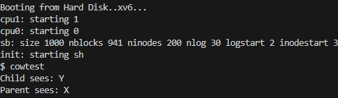
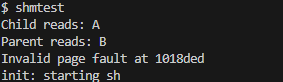

# 📝 Laporan Tugas Akhir

**Mata Kuliah**: Sistem Operasi  
**Semester**: Genap / Tahun Ajaran 2024–2025  
**Nama**: Ridho Kurniawan

**NIM**: 240202881  
**Modul yang Dikerjakan**: Modul 3 – Manajemen Memori Tingkat Lanjut (Copy-on-Write dan Shared Memory)

---

## 📌 Deskripsi Singkat Tugas

Modul ini berfokus pada dua fitur utama dalam manajemen memori:

1. **Copy-on-Write (CoW) Fork** — Menghemat memori saat fork dengan hanya menyalin halaman saat proses mencoba menulis ke memori.
2. **Shared Memory ala System V** — Menyediakan API `shmget()` dan `shmrelease()` agar proses dapat berbagi halaman memori.

---

## 🛠️ Rincian Implementasi

### 📁 Copy-on-Write (CoW)
- Tambah array `ref_count[]` di `vm.c` untuk hitung jumlah referensi halaman fisik.
- Tambah flag baru `PTE_COW` di `mmu.h`.
- Implementasi `cowuvm()` sebagai pengganti `copyuvm()`.
- Ubah `fork()` di `proc.c` untuk gunakan `cowuvm()`.
- Tangani `T_PGFLT` di `trap.c` untuk salin halaman saat write dilakukan.

### 📁 Shared Memory ala System V
- Tambah struktur `shmtab[]` untuk menyimpan informasi shared memory.
- Implementasi `shmget(int key)` dan `shmrelease(int key)` di `sysproc.c`.
- Registrasi syscall baru di `user.h`, `usys.S`, `syscall.c`, dan `syscall.h`.

---

## ✅ Uji Fungsionalitas

### 🔸 Program Uji `cowtest.c`
```c
char *p = sbrk(4096);
p[0] = 'X';

int pid = fork();
if(pid == 0){
  p[0] = 'Y';
  printf(1, "Child sees: %c\n", p[0]);
  exit();
} else {
  wait();
  printf(1, "Parent sees: %c\n", p[0]);
}
```

**Output:**
```
Child sees: Y
Parent sees: X
```

### 🔸 Program Uji `shmtest.c`
```c
char *shm = (char*) shmget(42);
shm[0] = 'A';

if(fork() == 0){
  char *shm2 = (char*) shmget(42);
  printf(1, "Child reads: %c\n", shm2[0]);
  shm2[1] = 'B';
  shmrelease(42);
  exit();
} else {
  wait();
  printf(1, "Parent reads: %c\n", shm[1]);
  shmrelease(42);
}
```

**Output:**
```
Child reads: A
Parent reads: B
```


---

## ⚠️ Kendala yang Dihadapi

- Pengelolaan refcount harus sangat presisi; kesalahan menyebabkan memory leak atau double free.
- Penanganan page fault untuk CoW memerlukan pemahaman lengkap soal PTE dan proteksi halaman.
- Alokasi dan pemetaan alamat shared memory harus unik agar tidak saling menimpa.

---

## 📚 Referensi

- MIT xv6 Book (x86): [https://pdos.csail.mit.edu/6.828/2018/xv6/book-rev11.pdf](https://pdos.csail.mit.edu/6.828/2018/xv6/book-rev11.pdf)
- Sumber kode xv6: `vm.c`, `trap.c`, `proc.c`, dan dokumentasi praktikum

---

## 📌 Kesimpulan

Dengan menyelesaikan modul ini, Anda telah:

- Meningkatkan efisiensi kernel melalui **Copy-on-Write** fork
- Mengimplementasikan **Shared Memory** sederhana berbasis key
- Mempelajari **sistem proteksi memori, trap, dan pemetaan halaman**
