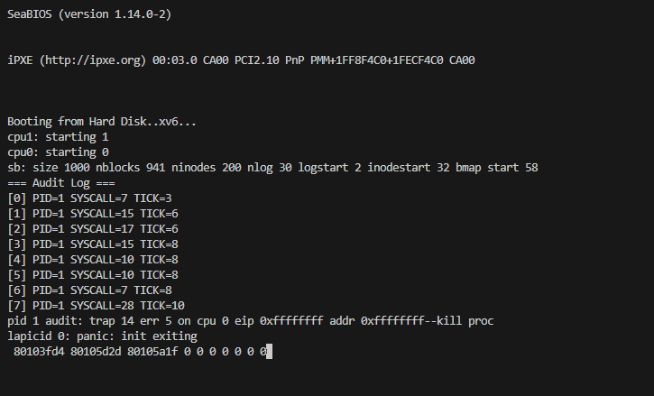

# 📝 Laporan Tugas Akhir

**Mata Kuliah**: Sistem Operasi  
**Semester**: Genap / Tahun Ajaran 2024–2025  
**Nama**: Ridho Kurniawan
**NIM**: 240202881
**Modul yang Dikerjakan**: Modul 5 — XV6: Audit dan Keamanan Sistem

---

## 📌 Deskripsi Singkat Tugas

**Modul 5 – Audit dan Keamanan Sistem**  
Menambahkan fitur audit untuk mencatat semua system call yang dipanggil oleh proses, serta membatasi akses audit log hanya untuk proses `init` (PID 1). Ditambahkan juga syscall baru `get_audit_log()` untuk membaca log secara terbatas.

---

## 🛠️ Rincian Implementasi

* Menambahkan struct `audit_entry` dan buffer `audit_log[]` di `syscall.c`
* Menambahkan pencatatan syscall di dalam fungsi `syscall()`
* Membuat syscall `get_audit_log()` di `sysproc.c`, hanya dapat dipanggil oleh PID 1
* Menambahkan entri syscall baru ke `syscall.c`, `syscall.h`, `user.h`, dan `usys.S`
* Membuat program uji `audit.c` untuk membaca isi log
* Menambahkan `_audit` ke `Makefile` agar dibangun otomatis

---

## ✅ Uji Fungsionalitas

* `audit`: Program untuk membaca dan mencetak log audit dari kernel
* Uji coba dilakukan dengan mengganti `init` menjadi `audit` agar dijalankan sebagai PID 1
* Verifikasi bahwa hanya PID 1 yang bisa membaca audit log

---

## 📷 Hasil Uji

### 📍 Contoh Output jika `audit` dijalankan sebagai PID 1:

```
=== Audit Log ===
[0] PID=1 SYSCALL=5 TICK=12
[1] PID=1 SYSCALL=6 TICK=13
...
```

### 📍 Contoh Output jika proses biasa memanggil `audit`:

```
Access denied or error.
```

---

## ⚠️ Kendala yang Dihadapi

* Salah parsing `argptr()` menyebabkan kernel panic
* Audit log cepat penuh karena tidak ada pembatasan proses yang dicatat
* Akses dibatasi hanya berdasarkan `pid`, belum ada otentikasi lebih lanjut

---

## 📚 Referensi

* [xv6 Book – Chapter 3 (System Calls)](https://pdos.csail.mit.edu/6.828/2018/xv6/book-rev11.pdf)
* [xv6-public GitHub Repository](https://github.com/mit-pdos/xv6-public)
* Diskusi GitHub dan Stack Overflow untuk parsing argumen di syscall xv6

---
